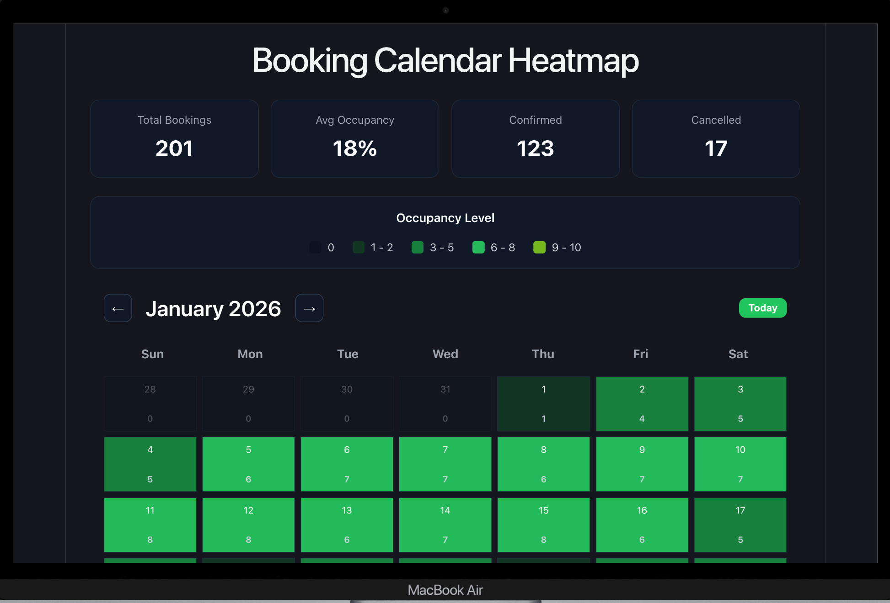
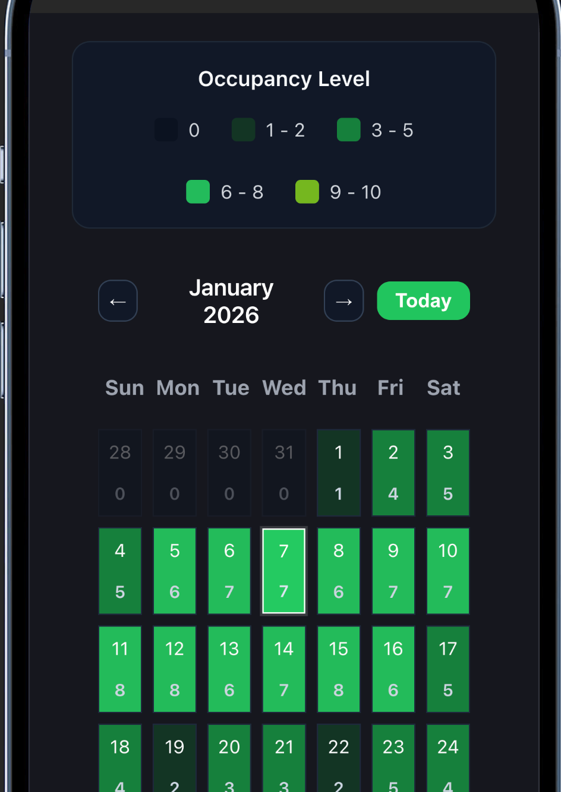
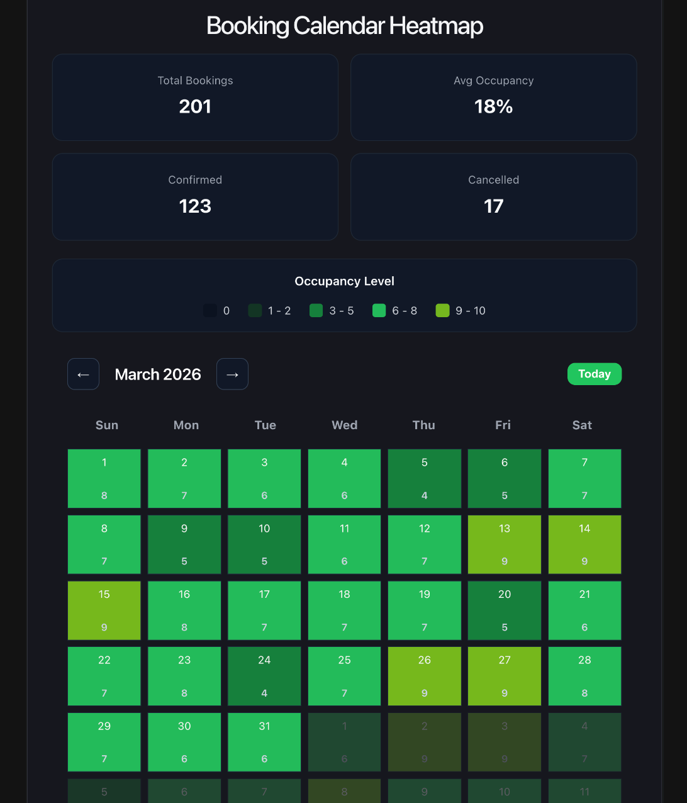

# Booking Calendar Heatmap

An interactive and responsive booking calendar heatmap built with React and Vite.

This project visualizes room occupancy using a heatmap-style calendar UI, allowing users to inspect booking density, drag-select date ranges, and view overlapping bookings in real time.

---

## Features

### Interactive Calendar Heatmap
- Dynamic calendar layout
- Monthly navigation
- Real-time occupancy visualization
- Heatmap-based booking intensity system

### Occupancy Color Scaling
Different occupancy levels are represented with different colors:

| Occupancy | Color Meaning |
|-----------|----------------|
| 0 | Empty |
| 1 - 2 | Very Low Occupancy |
| 3 - 5 | Medium Occupancy |
| 6 - 8 | High Occupancy |
| 9 - 10 | Nearly Full |

---

## Drag-to-Select Date Range
Users can:
- Click and drag across dates on desktop
- Drag-select dates using touch gestures on mobile devices
- Select custom booking ranges in both forward and backward directions
- View selected range details instantly
- Prevent accidental drag issues with improved mouse and touch handling

---

## Overlapping Booking Detection
The application dynamically detects bookings that overlap with the selected date range.

Each overlapping booking displays:
- Guest name
- Room number
- Check-in date
- Check-out date
- Number of nights
- Booking status

---

## Dashboard Statistics
The application includes a responsive statistics dashboard showing:

- Total bookings
- Average occupancy percentage
- Confirmed bookings
- Cancelled bookings

Animated counting effects were added for better UI experience.

---

## Occupancy Legend
A responsive occupancy legend helps users quickly understand the meaning of each heatmap color.

---

## Responsive Design
The application is fully responsive across:

- Mobile devices
- Tablets
- Laptops
- Desktop screens

Responsive improvements include:
- Adaptive stats cards
- Responsive calendar layout
- Responsive typography
- Flexible dashboard spacing
- Mobile-friendly navigation controls
- Responsive occupancy legend
- Mobile touch drag support
- Prevented accidental scrolling during mobile drag interactions

---

## UX Improvements
Additional UI/UX polish includes:

- Hover effects
- Smooth transitions
- Improved desktop and mobile drag interactions
- Disabled text selection during dragging
- Responsive button scaling
- Improved spacing and layout consistency

---

## Error & Loading States
The application handles:

- Loading states
- JSON/API parsing errors
- Empty booking states

---

## Tech Stack

- React
- Vite
- JavaScript
- CSS

---

## Project Structure

src/
├── assets/
├── components/
│   ├── Calendar/
│   ├── Legend/
│   └── Stats/
├── data/
├── utils/
├── App.jsx
└── main.jsx

---

## Live Demo

[Live Site](https://booking-calendar-heatmap-jade.vercel.app/)

---

## Installation

Clone the repository:

```bash
git clone https://github.com/Abraham3stack/booking-calendar-heatmap
```

Install dependencies:

```bash
npm install
```

Run the development server:

```bash
npm run dev
```

---

## Future Improvements

Potential future upgrades include:

- Backend integration
- Real booking API
- Authentication system
- Room filtering
- Booking creation modal
- Analytics dashboard
- Admin management system
- Export booking reports

---

## Screenshots

### Desktop View


### Mobile View


### Tablet View


---

## Deployment

This project can be deployed easily using:

- Vercel
- Netlify
- Render
- GitHub Pages

---

## Author

Built by Abraham Ogbu.